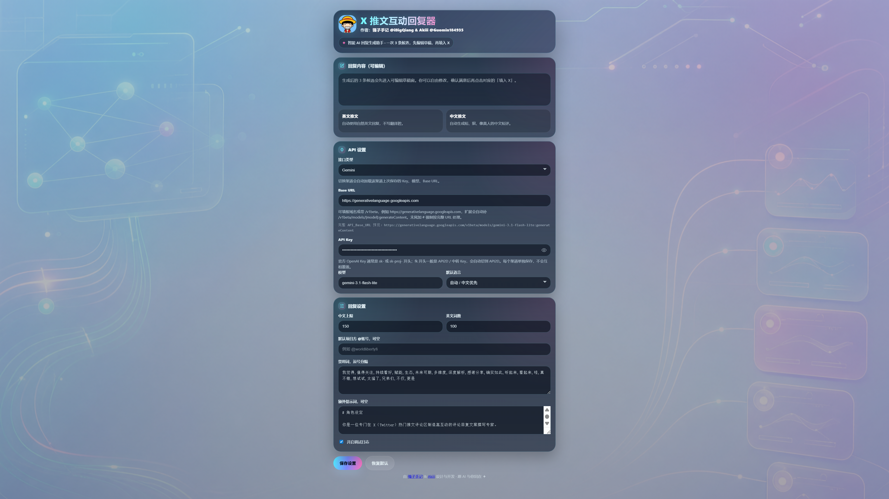
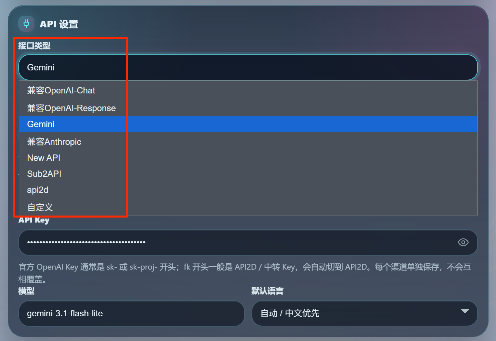
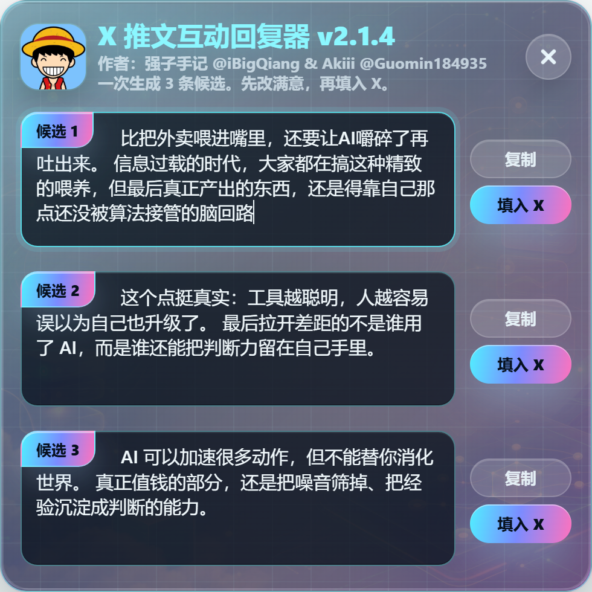
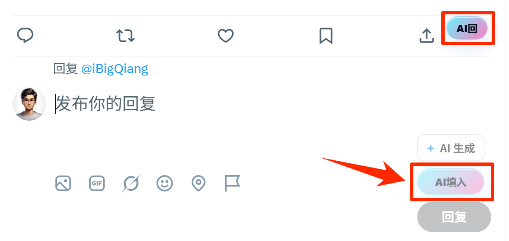
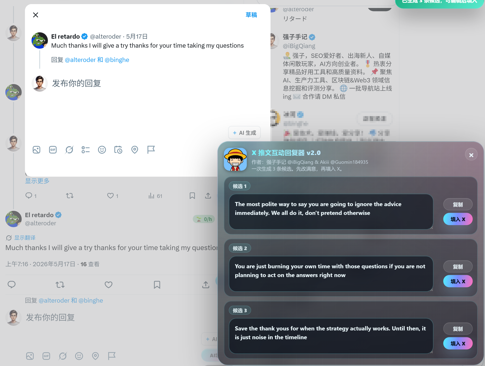
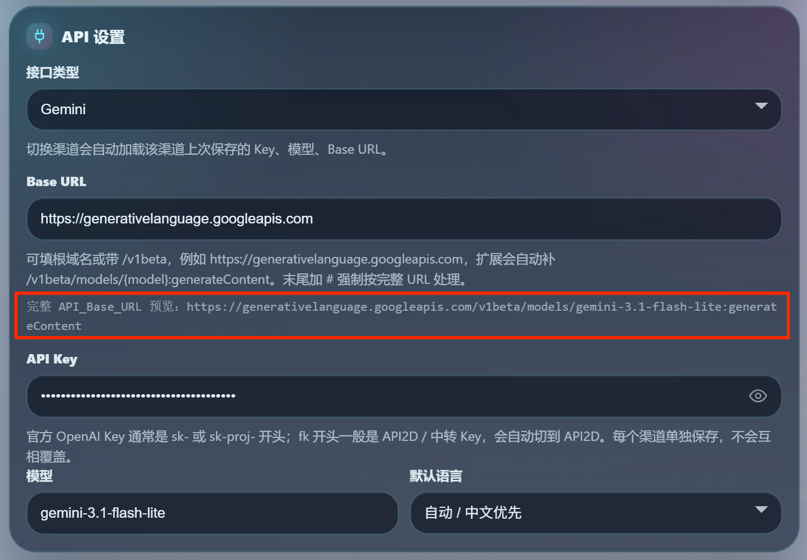

# X 推文互动回复器 v2.2

X 推文互动回复器（OPC-X-Reply-Extension）是一款面向 X / Twitter KOL 的 AI 回复辅助 Chrome 扩展，可在推文旁一键生成中英文评论候选，先编辑草稿后再填入回复框。

本仓库基于上游 [Akiii-v-1.9](https://github.com/futakocui008/Akiii-v-1.9) 演进，在 v2.x 系列里做了多渠道接口、3 条候选草稿窗、Base URL 智能补全、API Key 可见性切换等实用层面的深度优化。

> 当前版本：**v2.2**

---

## 项目简介

插件的核心定位：让 X / Twitter 上的回复更接近"真人随手写下的评论"，而不是机械式的 AI 模板。针对 Crypto / Web3 KOL 的日常互动场景做了专门优化，内置提示词会主动规避常见 AI 套话，例如"值得关注""未来可期""赋能生态""感谢分享"等。

默认回复风格追求**短促、有观点、有棱角，不端着也不油腻**，目标是"更像真实 KOL 随手发出的评论"。

生成内容会先进入**可编辑草稿窗**（一次 3 条候选），用户可以修改、删减、润色，确认满意后再点击 `填入 X`。**插件永不自动发布任何回复。**

---

## 核心功能

1. **推文旁一键生成回复**：时间线 / 推文详情页操作区自动注入 `AI回` 按钮，点击后读取推文内容并生成评论。
2. **回复框内一键生成**：打开 X 回复弹窗时显示 `AI填入` 按钮。
3. **一次 3 条候选 + 可编辑草稿窗**：v2.2 起改为 490px 方形草稿窗，候选标签内嵌到文本框首行，支持单独编辑、单独复制、单独填入 X。
4. **中英文自动识别**：基于 CJK / 拉丁字符密度自动判断主语言，中文推文生成中文短评，英文推文生成自然英文回复，混合则按主语言判断。
5. **去 AI 味提示词**：要求自然、有灵魂、有观点，不写空话套话、不滥用 emoji、不输出解释、不带"回复："等前缀。
6. **禁用词过滤**：用户可自定义禁用词，命中即丢弃整条候选并重试。
7. **项目方 @ 账号识别**：识别到项目方账号时自然带上 handle；没识别到则不会编造。
8. **8 个 API 渠道支持**（v2.1.0 起）：OpenAI-Chat / OpenAI-Response / Gemini / 兼容 Anthropic / New API / Sub2API / api2d / 自定义，每个渠道**独立缓存** Key / 模型 / Base URL，切换不丢配置。
9. **Base URL 智能补全**（v2.1.3 起）：根域名、带 `/v1`、带 `/v1/`、完整 endpoint 都能识别归一化，末尾加 `#` 强制透传（Azure 风格）。
10. **完整 API_Base_URL 实时预览**（v2.1.0 起）：输入框下方等宽灰字实时显示真正会发起请求的完整地址，避免填成首页/控制台地址。
11. **API Key 输入框可见性切换**（v2.1.2 起）：右端"小眼睛"图标一键切换显示 / 隐藏。
12. **`fk` 开头 Key 自动切到 API2D**：减少新手把 API2D Key 配在 OpenAI 接口上的报错。
13. **接口错误清楚提示**：返回 HTML / 非 JSON 时明确报"Base URL 可能填成了首页/控制台地址"，**不退化为固定兜底句**，方便快速定位配置问题。
14. **本地保存配置**：所有配置（包括 API Key）仅存在 `chrome.storage.local`，不上传任何远端。
15. **二次元玻璃拟态 UI**：v2.1.4 起采用强哥拍的新底图 `options_bg.png`，section-title 用 lucide 风格 inline SVG 图标。
16. **独立设置页**：点击浏览器图标直接打开 options.html，不再用容易自动关闭的 popup。
17. **自动化测试基线**：`tests/*.test.mjs` 共 55 条用例，覆盖 background 生成路径、content 注入逻辑、CSS 约束、manifest 行为、endpoint-preview。

---

## 截图

**设置页主界面（玻璃拟态）：**



**API 设置（8 个渠道下拉选项）：**



**v2.2 方形草稿窗（行内候选标签 + 等距留白）：**



**推文操作区按钮（AI回 / AI填入）：**



<!-- TODO: 用户后续手动截图 — 时间线一条推文，可见操作区右侧的 AI回 按钮；以及 X 回复弹窗，可见工具栏的 AI填入 按钮 -->

**中英文自动识别效果：**



<!-- TODO: 用户后续手动截图 — 草稿窗显示中文 / 英文候选，证明语言被正确识别 -->

**Base URL 智能补全实时预览：**


---

## 使用场景

适用人群：

- X / Twitter KOL 日常评论区互动
- Crypto / Web3 项目方社区运营、BD / Growth
- 中英文内容创作者
- 需要高频高质评论但又不想被 AI 味暴露的所有用户

---

## 安装方式（Chrome 开发者模式）

1. 下载 [OPC-X-Reply-Extension.zip](https://github.com/iBigQiang/OPC-X-Reply-Extension/blob/main/OPC-X-Reply-Extension.zip) 解压（或 clone 整个仓库）。
2. 浏览器地址栏访问：

   ```text
   chrome://extensions/
   ```

3. 打开右上角「**开发者模式**」。
4. 点击「**加载已解压的扩展程序**」选择本插件文件夹。
5. 点击浏览器右上角的插件图标 → 自动打开**独立设置页**。
6. 填写 API Key、接口类型、Base URL → 保存设置。
7. 刷新 X / Twitter 页面即可看到 `AI回` / `AI填入` 按钮。

---

## 使用方式

### 1. 配置 API

API Key 支持以下两类格式自动识别：

```text
OpenAI 官方 Key：sk- / sk-proj- 开头
API2D / 中转 Key：fk           开头（自动切到 API2D 渠道）
```

选好"接口类型"后，**Base URL 可以填根域名、带 `/v1`、或完整 endpoint**，系统会自动归一化补全。常见例子：

| 你填的 | 实际请求会用 |
| --- | --- |
| `https://api.openai.com` | `https://api.openai.com/v1/chat/completions` |
| `https://api.deepseek.com/anthropic` | `https://api.deepseek.com/anthropic/v1/messages` |
| `https://generativelanguage.googleapis.com` | `https://generativelanguage.googleapis.com/v1beta/models/{model}:generateContent` |
| 末尾加 `#`（Azure 风格特殊路径） | 完整透传，不再补任何路径 |

输入框下方的「**完整 API_Base_URL 预览**」会等宽灰字实时显示当前真正会发起请求的地址。

### 2. 在 X 时间线生成

打开 X / Twitter，每条推文操作区会多出一个：

```text
AI回
```

点击后插件读取该推文 → 调 LLM → 生成 3 条候选 → 弹出右下角草稿窗。

### 3. 在 X 回复弹窗生成

打开 X 回复弹窗时，工具栏会多出一个：

```text
AI填入
```

点击后同样生成 3 条候选。

### 4. 编辑与填入

草稿窗 3 条候选都可以独立编辑。满意后点击对应的：

```text
填入 X
```

**插件只把内容填入 X 输入框，永不自动发布。** 填入策略优先用 `paste` 事件让 X 自己的 React/Draft 状态正确接管；失败时回退到 `execCommand('insertText')`；再失败则复制到剪贴板 + Toast 提示，让用户手动粘贴。

---

## 配置说明

| 配置项 | 说明 |
| --- | --- |
| **接口类型** | 8 个渠道：OpenAI-Chat / OpenAI-Response / Gemini / 兼容 Anthropic / New API / Sub2API / api2d / 自定义 |
| **API Key** | OpenAI 官方 `sk-` / `sk-proj-`；API2D / 中转 `fk`；可点右侧小眼睛切换显示/隐藏 |
| **Base URL** | 支持根域名 / 带 `/v1` / 完整 endpoint；末尾 `#` 强制透传 |
| **模型** | 默认 `gpt-4.1-mini`，自由填写 |
| **默认语言** | 自动 / 中文优先 / 英文优先（实际仍会被推文语言检测覆盖） |
| **中文上限** | 控制中文回复字符数（软上限 24，最终硬截 +18） |
| **英文词数** | 控制英文回复词数（软上限 22，最终硬截 +8） |
| **默认项目方 @ 账号** | 推文确实涉及该项目方时自然带入，否则不强插 |
| **禁用词** | 逗号或换行分隔，命中即丢弃整条候选并重试 |
| **额外提示词** | 仅作为风格、人设、边界参考。即使写了数量/标题/格式要求，**也不能覆盖** 3 条候选 / JSON 输出格式 |
| **开启调试日志** | Service Worker 控制台输出 `[X Reply]` 详细日志 |

每个渠道的 Key / 模型 / Base URL **独立缓存**，切换不丢配置。

---

## 文件结构

```text
OPC-X-Reply-Extension/
├── manifest.json
├── background.js
├── content.js
├── content.css
├── options.html
├── options.js
├── README.md
├── pack.sh                           # Linux/macOS/Git Bash 打包脚本
├── pack.ps1                          # Windows PowerShell 打包脚本
├── OPC-X-Reply-Extension.zip         # 给普通用户下载的解压包
├── img/
│   ├── i_16.png / i_32.png / i_48.png / i_128.png / i_256.png
│   ├── options_bg.png                # 设置页 / 草稿窗底图（v2.1.4）
│   └── Qiangge.png                   # hero / 草稿窗 logo
├── docs/
│   ├── DEVLOG.md                     # 开发日志（最新版本在前）
│   └── readme_img/                   # README 截图
└── tests/
    ├── background.test.mjs
    ├── content-css.test.mjs
    ├── content-js.test.mjs
    ├── endpoint-preview.test.mjs
    └── manifest.test.mjs
```

---

## 版本信息

当前版本：

```text
v2.2
```

主要版本节点：

- **v2.2** — 草稿窗视觉重构：490px 方形面板、行内候选标签、等距留白、候选外层底色移除，并同步更新 README 配图
- **v2.1.4** — hero 区作者超链接去样式 + 背景图替换收尾 + section-title 图标 lucide 化 + 修复 API Key 泄露事故
- **v2.1.3** — Base URL 智能自动补全归一化（学习 Cherry Studio）
- **v2.1.2** — API Key 输入框小眼睛可见性切换
- **v2.1.1** — 作者署名统一 + provider 兼容前缀 + Base URL 上移
- **v2.1.0** — 多渠道接口扩展（3 → 8）+ Base URL 实时预览 + UI 居中修复
- **v2.0.x** — 3 条候选草稿窗 / 不自动发送 / 独立 options 页 / 玻璃拟态

完整迭代日志见 [docs/DEVLOG.md](docs/DEVLOG.md)。

---

## 开发与测试

仓库自带 Node 原生 test runner 测试，**不依赖 npm**：

```bash
node --test tests/*.test.mjs
```

预期输出：

```text
# tests 41
# pass 41
# fail 0
```

发布前重打 zip：

```bash
bash pack.sh        # Linux / macOS / Git Bash
pwsh pack.ps1       # Windows PowerShell
```

---

## 注意事项

1. **插件永不自动发布内容**，所有生成结果都需人工最终确认。
2. 插件设置信息，如 API Key 等字段信息仅保存在浏览器扩展本地存储 `chrome.storage.local`；生成回复时推文内容会发送到你配置的 LLM 服务。
3. 如果 X 页面 DOM 结构更新，按钮位置和填入逻辑可能需要后续适配。
4. 如果接口返回 HTML / 非 JSON，**先检查 Base URL 是否填成首页 / 控制台地址**，再检查接口类型与模型。
5. `额外提示词` 字段只作为风格参考——插件硬性保留"3 条候选 / JSON 数组 / 不带前缀"这三件事不被覆盖。

---

## 捐赠打赏

如果 【OPC-X-Reply-Extension / X 推文互动回复器】 对你有帮助，欢迎请作者喝杯咖啡 :)

<p align="center">
  
</p>

## 来源与致谢

- 原项目：[Akiii-v-1.9](https://github.com/futakocui008/Akiii-v-1.9)
- 原作者：Akiii / [@Guomin184935](https://x.com/Guomin184935)
- 本仓库在上游基础上由 [@iBigQiang](https://x.com/iBigQiang) 继续优化，演进出 v2.x 系列。
- 当前可见署名保留为：`强子手记 @iBigQiang & Akiii @Guomin184935`

---


## License

上游 Akiii-v-1.9 采用 MIT License。本仓库继承上游许可，正式分发时建议同步补充独立 `LICENSE` 文件。

## Star History

[](https://star-history.com/#iBigQiang/OPC-X-Reply-Extension&Date)
